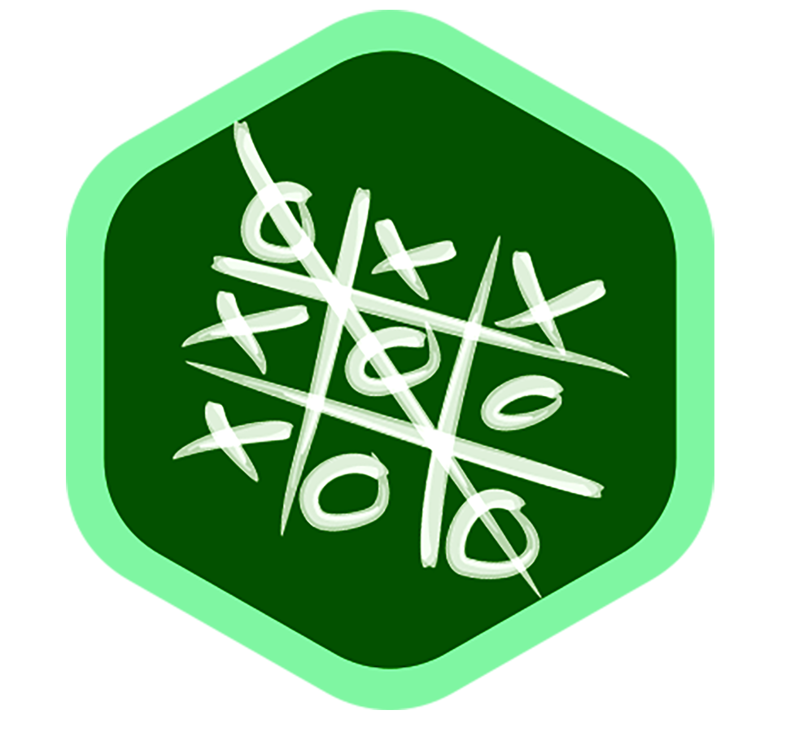

# Tic-Tac-Toe Game


<p align=center>
    
</p>


This **Tic-Tac-Toe** game is designned with **`Python`**. The game can be played between [*two player(player vs player mode)*](#-player-vs-player-mode) or with [*computer(player vs computer mode)*](#-player-vs-computer-mode). 

The *player vs computer mode* is so intelligent that it can predict almost all of the possible ways that human brain can think of, which make it difficult for any player to defeat the computer. There is a **package** named **`Computer`** that performs as a *brain* while playing with computer and does all the *logical calculation*.

The **`src`** directory contains all of the source code. In this directory there is **module** named as *`lib.py`*  that contains all the funstions and required data for the game.

<br/>

### Player vs Player Mode:

------

The *`main.py`* file is executed first. That calls the function below:

```python
start_play() 
```

This funtion first initiate a dictionary *`game_data`* that holds all the move of the game.  Then the below functions are called one by one.

<br/>

```python
game_type_selection()
```

This function lets the user to select how he **wants to play**, eather with another player or with computer. 

<br/>

```python
character_selection()
```

This function lets the user to select a **character** for him, and also lets the second player to select another one. While playing against computer, the character for the computer is auto selected depending on the character that the user selected for him.

<br/>

```python
print_board()
```

This function prints a **tic-tac-toe board** with data from the dictionary  *`game_data`*. 

<br/>

Then a **while loop** runs, for total 9times, that allows the player and computer to provide there move one by one. In each cycle, the function is called: 

```python
get_winner()
```

This function checks the dictionary *`game_data`* to find the winner based on the *game rules*.

<br/>

Any time user can leave the game, while asked for his move, using the command **`exit`**.

<br/>

### Player vs Computer Mode:

---

The package **`Computer`** is used for this mode. While playing against computer, in *`main.py`* file a while loop runs and takes input from player and computer one by one. When it's computer turn, then the below function is called:

```python
computer_brain()
```

This function does all the logical calculation to generate a move for the computer. This decision making is done in several steps, for that the following functions are used. All the functions are coming from the **module** named *`computerLib.py`* 

<br/>

```python
checkWinningMove()
```

This function checks for the move that can make a win for the computer. This function is also checks for the move that can block the win of the player.

<br/>

```python
triangleAttack()
```

This function creates a traingle attack, that creates oppurtunities for the computer to win.

<br/>

```python
firstMethod()
```

This function helps to select move based on several criteria.

<br/>

```python
findBlank()
```

This function finds blank position on the board, so that the computer can make move to that blank position.

<br/>

---

#### Try live demo of the game

[**click here**](https://www.google.com/search?q=tic+tac+toe)

